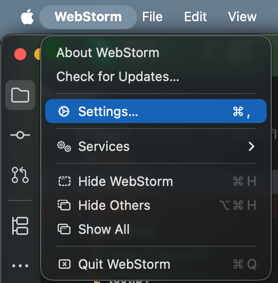
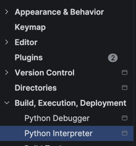

# Frontend

Runs with
```bash
cd frontend

npm i

npm run dev
```

Frontend should be visible on
>localhost:5173

# Backend 

Can be started with going into backend folder and running after starting your venv
If you need a new venv: (first time)

```bash
cd backend
python3 -m venv .venv
pip install -r requirements.txt
exit
```

Start the backend:
```bash
cd backend
source .venv/bin/activate
pip install -r requirements.txt
fastapi dev main.py
```

Backend should be visible on
>localhost:8000


Debug:
Should both be in venv:
>which pip

>which python

You might have to check that the interpreter of your IDE is the same as the one in your venv.
In webstorm this can be done in settings. This project is coded in Jetbrains WebStorm





Choose an existing one, change it to the /backend/.venv/bin/python
You might need to install a python extension for your IDE.
